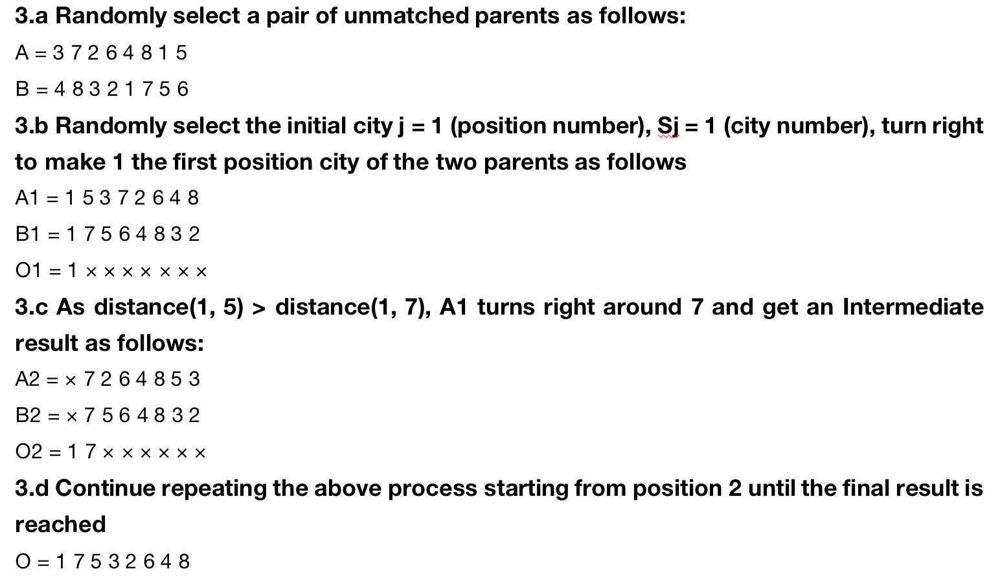

# Genetic Algorithm Solution For Travelling Salesman Problem
This project is supported by USC CSCI561 teaching team.

## Background
TSP is defined as given a list of cities/locations, the person has to go to all the locations exactly once, return back to the starting point, and cover the minimum distance as a whole.
 

A location is represented as a combination of 3D coordinate points, x, y, and z. For example: (10, 0, 30) represents a city with x= 10, y = 0, z= 30. 

## Steps
1. Initial Population
2. Parent Selection: Roulette wheel based
3. Crossover: HGA Based
 

## References
1. CSCI 561- Fall 2022-Homework 1.pdf
2. Solution of TSP problem based on hybrid genetic simulated annealing algorithm.pdf
3. 旅行商问题(TSP)的改进遗传算法.pdf
4. 遗传算法及其在 TSP 问题求解中的应用.pdf